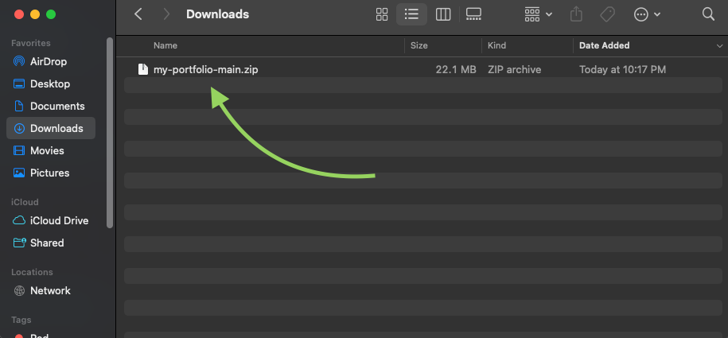

# Employee Tracker


<br>

## Description

Employee Tracker is a console application for business owners that helps organize and keep track of their employees and departments. It utilizes `MySQL` to establish a relational database that can be queried via the application's options.

In creating this project, I learned a lot about connecting `Node.js` with `MySQL` to perform useful operations on a relational database via user input.

<br>

## Table of Contents

- [Installation](#installation)
- [Usage](#usage)
- [Technology](#technology)
- [License](#license)

<br>

## Installation




3. Once unzipped, ensure that MySQL is installed and hosting a live server

4. Open the `config` directory and edit lines 6-9 with your MySQL server information to ensure a proper connection.

5. Run the `schema.sql` and `seeds.sql` files in either DBeaver or via the command-line to initiate the database and seed it with initial data. (Running the seeds.sql file is optional, but may be useful if it contains all of the information you wish to include).

6. Run the following commands to install all dependencies and start the application

```
npm install

npm start
```

<br>

## Usage

[Video Walkthrough](https://drive.google.com/file/d/1FWiNKN9f1Cvb2eF38X-TNo_sC25vec6d/view?usp=sharing)

This console application can be used to keep track of all employees and departments within a company or organization. It allows users to perform useful operations such as:
- View all departments
- View all roles
- View all employees
- Add a department
- Add a role
- Add an employee
- Update an employee role

<br>

## Technology
Listed below is all of the technology I used for this project:
- Node.js
- MySQL / MySQL2
- Inquirer
- Dotenv
- Console.table

<br>

## License

    Copyright © 2022 Dalian Grullon

    Permission to use, copy, modify, and/or distribute this software for any purpose with or without fee is hereby granted, provided that the above copyright notice and this permission notice appear in all copies.

    THE SOFTWARE IS PROVIDED "AS IS" AND THE AUTHOR DISCLAIMS ALL WARRANTIES WITH REGARD TO THIS SOFTWARE INCLUDING ALL IMPLIED WARRANTIES OF MERCHANTABILITY AND FITNESS. IN NO EVENT SHALL THE AUTHOR BE LIABLE FOR ANY SPECIAL, DIRECT, INDIRECT, OR CONSEQUENTIAL DAMAGES OR ANY DAMAGES WHATSOEVER RESULTING FROM LOSS OF USE, DATA OR PROFITS, WHETHER IN AN ACTION OF CONTRACT, NEGLIGENCE OR OTHER TORTIOUS ACTION, ARISING OUT OF OR IN CONNECTION WITH THE USE OR PERFORMANCE OF THIS SOFTWARE.
